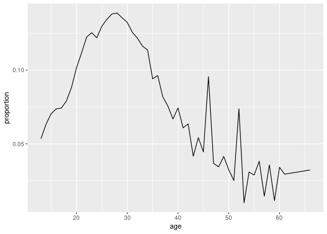

Project proposal
================
CPL

``` r
library(tidyverse)
library(broom)
olympics <- readr::read_csv('https://raw.githubusercontent.com/rfordatascience/tidytuesday/master/data/2021/2021-07-27/olympics.csv')
```

*For instructions on what each section should include, please see the
[project page](https://idsed.digital/assessments/project/#proposal) on
the course website. Remove this text when completing your proposal*.

## 1. Introduction

We got this dataset from Tidytuesday, and it was collected by
JThomasmock from www.sports-reference.com.

Each case is the athletes, and the variables are id, name, sex, age,
height, weight, team, noc, games, year.

General research question:

1.  Are younger athletes more likely to have a better performance than
    older athletes?

2.Does the athletes from the host country tends to behave better by
gaining more medals?

## 2. Data

``` r
glimpse(olympics)
```

    ## Rows: 271,116
    ## Columns: 15
    ## $ id     <dbl> 1, 2, 3, 4, 5, 5, 5, 5, 5, 5, 6, 6, 6, 6, 6, 6, 6, 6, 7, 7, 7, …
    ## $ name   <chr> "A Dijiang", "A Lamusi", "Gunnar Nielsen Aaby", "Edgar Lindenau…
    ## $ sex    <chr> "M", "M", "M", "M", "F", "F", "F", "F", "F", "F", "M", "M", "M"…
    ## $ age    <dbl> 24, 23, 24, 34, 21, 21, 25, 25, 27, 27, 31, 31, 31, 31, 33, 33,…
    ## $ height <dbl> 180, 170, NA, NA, 185, 185, 185, 185, 185, 185, 188, 188, 188, …
    ## $ weight <dbl> 80, 60, NA, NA, 82, 82, 82, 82, 82, 82, 75, 75, 75, 75, 75, 75,…
    ## $ team   <chr> "China", "China", "Denmark", "Denmark/Sweden", "Netherlands", "…
    ## $ noc    <chr> "CHN", "CHN", "DEN", "DEN", "NED", "NED", "NED", "NED", "NED", …
    ## $ games  <chr> "1992 Summer", "2012 Summer", "1920 Summer", "1900 Summer", "19…
    ## $ year   <dbl> 1992, 2012, 1920, 1900, 1988, 1988, 1992, 1992, 1994, 1994, 199…
    ## $ season <chr> "Summer", "Summer", "Summer", "Summer", "Winter", "Winter", "Wi…
    ## $ city   <chr> "Barcelona", "London", "Antwerpen", "Paris", "Calgary", "Calgar…
    ## $ sport  <chr> "Basketball", "Judo", "Football", "Tug-Of-War", "Speed Skating"…
    ## $ event  <chr> "Basketball Men's Basketball", "Judo Men's Extra-Lightweight", …
    ## $ medal  <chr> NA, NA, NA, "Gold", NA, NA, NA, NA, NA, NA, NA, NA, NA, NA, NA,…

## 3. Data analysis plan

Are younger athletes more likely to have a better performance than older
athletes?

``` r
olympics %>%
  select(age, medal) %>%
  na.omit(medal) %>%
  group_by(age) %>%
  count(medal) %>%
  ggplot(aes(x = age, y = n)) +
  geom_line()
```

<!-- --> The x
variable is the age and the y variable is the number of medals. A bar
plot or a line graph can be used. If the peak from the graph appears to
be at the younger age end, that means the younger athletes are more
likely to have a better performance than older athletes. So the position
of the peak is needed to support our hypothesized answer.

Does the athletes from the host country tends to behave better by
gaining more medals?

We will choose a number of years and change the host city names into
their countries name so that we can compare the data. We may use scatter
diagram to denote the number of the medals for the host countries and
other countries and then facet them to make the graph more tidy. An
anomalous point for that country in the year that country hosted on the
graph can support our hypothesized answer.
